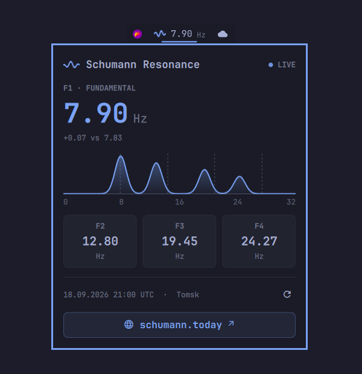

# Schumann Resonance for Omarchy

Live Schumann resonance frequencies from [schumann.today](https://schumann.today) in your Omarchy bar.



The bar shows the fundamental mode (F1) next to a small wave animated in your theme's accent color. Click it to open a panel with:

- F1 in large type, with its offset from the classic 7.83 Hz
- A spectrum of the four modes (F1–F4) at their measured frequencies. Dashed lines mark the classic values: 7.83, 14.3, 20.8 and 27.3 Hz.
- Cards for F2, F3 and F4
- When the reading was taken (UTC) and a link to schumann.today

Readings come from the Tomsk State University observatory, via schumann.today's public API. The widget checks for new data every 60 seconds.

## Controls

| Action | Result |
|---|---|
| Left click | Open or close the panel |
| Right click | Open schumann.today in your browser |
| Middle click | Refresh now |
| `R` in the panel | Refresh now |
| `O` in the panel | Open schumann.today |

The panel can also be toggled from a keybinding or script:

```bash
omarchy-shell today.schumann.monitor toggle
```

## Install

```bash
omarchy plugin add https://github.com/ricardofriba/omarchy-schumann
```

Accept the prompt to enable it and pick a bar section. To add it to the bar later:

```bash
omarchy plugin enable today.schumann.monitor
```

## Remove

```bash
omarchy plugin remove today.schumann.monitor
```

This takes the widget off the bar and deletes the plugin folder. Nothing else on your system is changed.

## Settings

The settings are stored on the widget's entry in `~/.config/omarchy/shell.json`:

```bash
omarchy bar set today.schumann.monitor modes all            # show F1 · F2 · F3 · F4 in the bar
omarchy bar set today.schumann.monitor refreshSeconds 120   # polling interval in seconds (minimum 30)
omarchy bar set today.schumann.monitor animate false --json # keep the wave still
```

## Dependencies

- `curl`, which Omarchy ships by default, to fetch `https://schumann.today/api/public/snapshot`
- `xdg-open`, to open the site in your browser

The plugin sends no data anywhere. It only makes a GET request to the endpoint above, over HTTPS only, and caps the response at 32 KB: `curl` aborts the transfer past that ceiling, and a truncated body is never parsed.

## License

[MIT](LICENSE)
